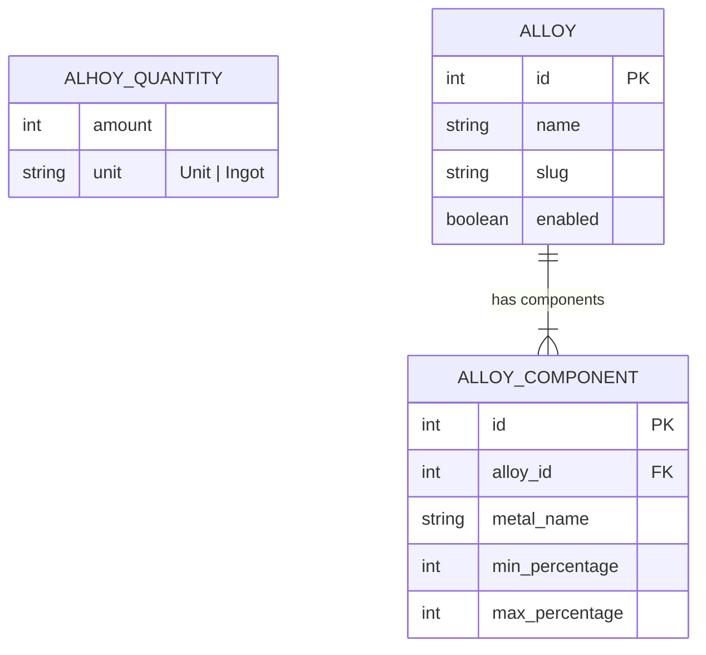

# Data Model

```mermaid
erDiagram
    ALHOY_QUANTITY {
        int amount
        string unit "Unit | Ingot"
    }

    ALLOY {
        int id PK
        string name
        string slug
        boolean enabled
    }

    ALLOY_COMPONENT {
        int id PK
        int alloy_id FK
        string metal_name
        int min_percentage
        int max_percentage
    }

    ALLOY ||--|{ ALLOY_COMPONENT : "has components"
```
